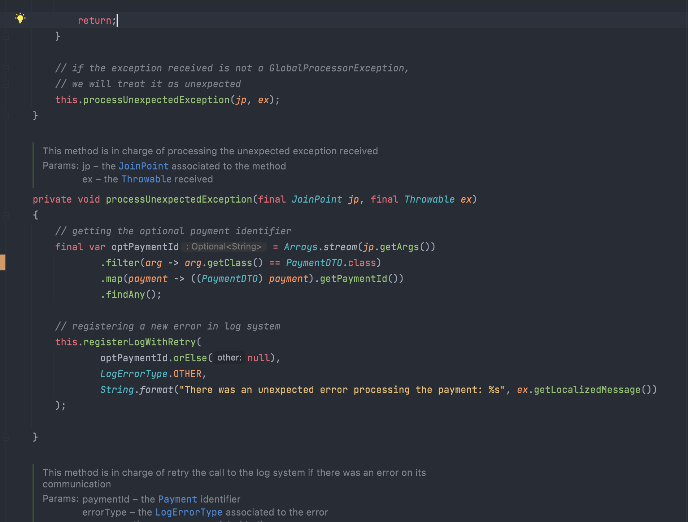
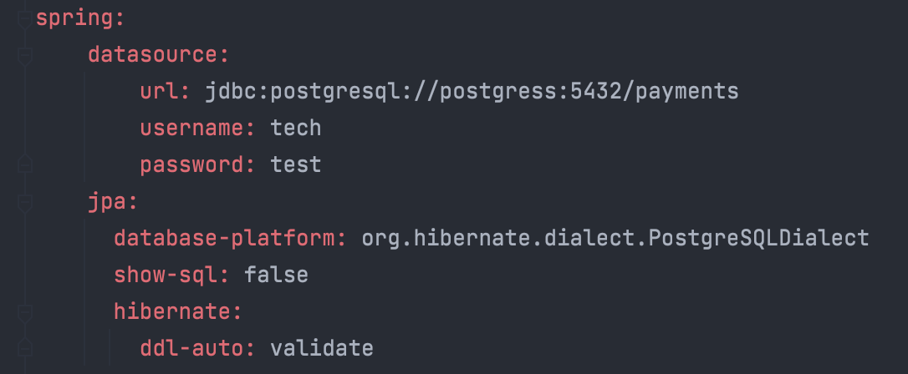

# (wefox) -> "wefox Java Interview";


------

## :information_desk_person: What is the Challenge?

**Technical Test Inc.** is a clothing company that recently had a big commercial success. As a result, the number of transactions has dramatically increased, and the old system doesn't scale to the required transaction rate on peak hours. 

For this reason the system has been redesigned and one of the key pieces is the new payment processor. This new microservice will consume payments from the message broker and process them at its own pace. In addition, it will communicate via REST API with third parties for validation and logging. Your goal is to implement this microservice.

------

## :computer: How to Install and Run the Project

First of all, you need to build the image associated with the new service. You should have installed the *Docker Framework* to be able to start the tests against the built processor. So, after install the *Docker* tool you need to go under the **processor folder** and exec the following command:

```bash
docker build -t processor .
```

And after that, you should navigate to the **delivery** **folder** and execute the next command:

```bash
docker-compose up -d zookeeper-server kafka-server postgress api-producer processor
```

If everything went well, you will see something like the following image in your *Docker Desktop*: 


------

## :memo: Technical Design

In this step, I'm going to describe on high level how I built the micro-service code. It will be divided in 4 parts:

1. Project Packaging Structure
2. How does it integrate with the *Kafka Platform*?
3. How does it manage the errors?
4. How does it integrate with the database?

------

### :package: Project Packaging Structure

As soon as you navigate to the processor code, you will see the following structure:


- **aspects**: This package will contain every *AspectJ* created on the micro-service.
- **config**: This package will be in charge of defining every bean of the application (except the *Spring Cloud Functions* services). 
- **core**: This package will be in charge of containing every behavior adherent to the domain logic (model definition, exception classes, services exposed, etc.)
- **external**: This package will be in charge of containing every third party client logic, database repositories, etc.
- **events**: This package will be in charge of containing every integration with external events (in this case it will be the *Kafka Streaming Platform*)

------

### :shopping_cart: How does it integrate with the *Kafka Platform*?

So I wanted to implement a very loosely coupled solution. For that reason, I used the *Spring Cloud Stream* + *Spring Cloud Function* tools. These tools are very useful because we can change of broker whenever we want, the Spring Cloud team can integrate with so many brokers services, so if we want to change to a RabbitMQ platform, we only need to change its application.yaml configuration (and maven dependencies, of course).


You can find the **online** and **offline** entrypoints on the */events/functions* package, here I defined one bean for each input topic with the *onlinePayment* and *offlinePayment*. These beans will be binded on the *spring.cloud.stream.function.definition* property. I had also binded the topic with the associated function by the following property: *spring.cloud.stream.function.bindings*.

> You can see more info about this configuration on: [docs.spring.io](https://docs.spring.io/spring-cloud-stream/docs/3.1.3/reference/html/spring-cloud-stream.html#:~:text=Some%20times%20to,require%20explicit%20names.)

------

### :face_with_head_bandage: How does it manage the errors?

For this purpose I defined an **aspect**. You can locate it on the ***/aspects*** root folder and it will have an invocation to the **error manager** service. It will be listening to every exception thrown by a method marked with the *LogSystem* annotation. It also has a *dirty retry strategy*, that could be fine to define it with generic types on a utility package (but it could be unnecessary for this interview test).

Also, you can find the error manager client on the ***/external/client/logs/*** path


If the exception is a **custom one**, we will get the necessary fields from it. Otherwise, we need to check the method's arguments trying to find the Payment Id associated with the error. You can see this logic on the following image:



------

### :floppy_disk: How does it integrate with the database?

For this purpose I integrated with **Spring Data JPA**. This tool is useful for the moments that we need to change the database framework. The Spring Data team has so many frameworks to integrate with, so it's a fantastic idea to implement it on our projects.

You can find every entity model and its related *DAO* interface on the ***/external/db/repository*** path.


You can also find the database connection on the application.yaml properties. You can see them on the following image:



------

## :pushpin: Things to improve

After end this interview test, I can find some things that could improve the efficiency and the cleanliness of the micro-service.

1. I developed this solution on the imperative way, it could be a great step to migrate it into the reactive one using the [Project Reactor Framework](https://projectreactor.io/). I think that the project would improve on thread management and memory usage metrics.
2. The retry strategy that I had implemented was not the best in the world, because right now I can't use it on other clients. So it would be a nice next step to implement some type of library to retry on a condition. I implemented that ugly solution because the @Retry Spring annotation only listen for exceptions, and not for method returning values, or some other conditions. It could be good to add some tools to the Spring Boot base.
3. And obviously, it could be great that the unit testing was 100% done. :thinking:

